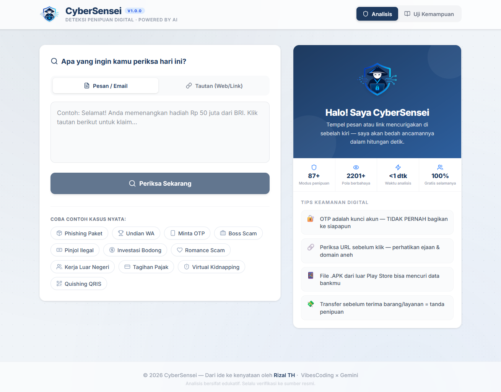

<div align="center">
  
  <h1>🛡️ CyberSensei</h1>
  <p><strong>Deteksi Penipuan Digital &middot; Powered by AI (Client-Side Engine)</strong></p>
  <p>Dikembangkan untuk <b>#JuaraVibeCoding</b> 2026 oleh <b>Rizal TH</b></p>

  <br/>

  
  
  
  
  
  
</div>

<div align="center">
  <br/>
  
  <br/>
  <em>Tampilan utama CyberSensei — tempel pesan mencurigakan, dapatkan analisis instan.</em>
  <br/><br/>
</div>

---

## 📌 Apa itu CyberSensei?

**CyberSensei** adalah mesin analisis keamanan siber *client-side* yang mendeteksi modus penipuan digital modern (scam, phishing, vishing, sextortion, deepfake, pig butchering, dll.) dalam bahasa Indonesia secara *real-time* — sepenuhnya berjalan di peramban pengguna **tanpa mengirim data ke server manapun**.

Dirancang untuk melindungi masyarakat Indonesia dari ancaman digital yang terus berkembang, CyberSensei menggabungkan **Threat Intelligence Database** lokal berisi **87+ modus penipuan** dengan engine analisis multi-layer yang mampu mendeteksi teks yang diobfuskasi (leet-speak, spaced-out text, zero-width characters, dan Unicode homoglyphs).

---

## 🏗️ Arsitektur Detection Engine

CyberSensei menggunakan pendekatan **Multi-Layered Detection Pipeline** yang dieksekusi seluruhnya di browser:

```
Input (Teks/URL)
  │
  ├─ Layer 1: Preprocessing & Normalization
  │   ├── Unicode NFKD normalization
  │   ├── Emoji removal & zero-width character stripping
  │   ├── Homoglyph normalization (Cyrillic, Greek, Latin Extended, Fullwidth ASCII)
  │   ├── Leet-speak decoding context-aware (3→e, 0→o, !→i, $→s, dll.)
  │   └── Spaced-out text collapse ("S E L A M A T" → "SELAMAT")
  │
  ├─ Layer 2: Regex Pattern Matching (40+ rules)
  │   ├── Weighted scoring (critical / high / moderate)
  │   ├── Logarithmic score decay per kategori
  │   ├── Negation detection ("jangan berikan OTP" ≠ "berikan OTP")
  │   └── Dangerous combo detection (shortlink + urgency, OTP + pressure, dll.)
  │
  ├─ Layer 3: Fuzzy Search — Fuse.js
  │   ├── Dynamic threshold berdasarkan panjang input
  │   ├── Multi-match scoring (top-3 results)
  │   └── Jaccard Similarity fallback
  │
  ├─ Layer 4: URL/Domain Analysis
  │   ├── TLD risk scoring (two-tier: high / moderate)
  │   ├── Brand typosquatting detection (90+ brand Indonesia & global)
  │   ├── IDN Homograph attack detection (Cyrillic/Greek → Latin)
  │   ├── URL shortener identification (70+ layanan)
  │   ├── Open redirect detection
  │   ├── Auth deception (user@host format)
  │   ├── Free subdomain / serverless hosting flags
  │   └── Whitelist shield untuk domain resmi terverifikasi
  │
  └─ Layer 5: Decision Engine
      ├── Weighted score aggregation
      ├── Critical rule override
      ├── Whitelist shield (final safety override)
      └── Verdict: AMAN / MENCURIGAKAN / BERBAHAYA
```

---

## ✨ Fitur Utama

| Fitur | Deskripsi |
|---|---|
| 🚀 **Analisis < 1 Detik** | Sepenuhnya *client-side*, tanpa latency API backend |
| 🔒 **Privacy First** | Data **tidak pernah** dikirim ke server manapun — tetap di perambanmu |
| 🧠 **87+ Modus Penipuan** | Database Threat Intelligence lokal Indonesia yang dikurasi manual |
| 🔍 **40+ Regex Rules** | Deteksi pola psikologis penipu: urgensi, ancaman, pamer kekayaan |
| 🎭 **Anti-Obfuscation** | Leet-speak, Unicode homoglyph, zero-width char, spaced-out text |
| 🌐 **URL Deep Analysis** | Typosquatting, homograph attack, shortener, TLD scoring |
| 🎮 **Mini-Kuis Edukasi** | Latih kepekaan terhadap pesan penipuan secara interaktif |
| 📸 **Simpan & Bagikan** | Ekspor hasil analisis sebagai gambar PNG untuk dibagikan |
| 📱 **Responsive** | Nyaman digunakan di ponsel maupun laptop |
| 📜 **Riwayat Analisis** | 5 analisis terakhir tersimpan di `localStorage` |

---

## 🎯 Modus Penipuan yang Dideteksi

<details>
<summary><b>Klik untuk lihat daftar lengkap 87+ modus</b></summary>

| Kategori | Threat Level | Contoh Modus |
|---|---|---|
| Phishing Paket/Kurir APK | High | Surat resi palsu berisi file APK |
| Undian Palsu WhatsApp/SMS | Critical | Klaim menang undian Shopee/Tokopedia |
| Tautan Perbankan Palsu | Critical | Situs klikBCA/BRImo tiruan |
| Surat Tilang Digital Palsu | High | File APK berkedok surat tilang ETLE |
| Undangan Pernikahan APK | High | File APK berkedok undangan digital |
| Quishing (QR Code Phishing) | High | QRIS palsu ditempel di merchant |
| Deepfake AI Investasi | Critical | Video palsu tokoh publik promosi investasi |
| Impersonasi Aparat (Vishing) | Critical | Telepon dari "polisi/jaksa" palsu |
| Recovery Scam | High | Tawaran pemulihan dana untuk korban |
| Pig Butchering / Romance Scam | Critical | Kenalan online → ajakan investasi |
| Task Scam / Lowongan Palsu | High | Like & subscribe dapat komisi + deposit |
| SMS Tagihan Palsu | High | PLN/Pajak/BPJS palsu |
| Hadiah Provider Palsu | High | Poin Telkomsel/Indosat palsu |
| Minta OTP / Takeover Akun | Critical | "Aku salah kirim OTP ke nomormu" |
| CEO/Boss Scam (BEC) | Critical | "Ini bos, transfer segera, rahasia" |
| Bansos / Subsidi Palsu | High | BLT/PKH/BPUM palsu |
| Email Phishing Akun Digital | Critical | Netflix/Google/Apple akun suspended |
| Invoice / Tagihan Palsu | High | Faktur palsu mendesak |
| Reset Password Palsu | Critical | Tautan reset password ke situs phishing |
| Typosquatting & Brand Spoofing | Critical | tok0pedia.com, bca-verifikasi.com |
| Crypto Airdrop / Drainer | Critical | "Connect wallet untuk klaim token" |
| Kerja Luar Negeri (TKI/PMI) | Critical | Lowongan Malaysia/Dubai palsu |
| Pura-pura Kenal (Impersonasi) | High | "Hai, ingat aku nggak?" |
| Toko Online Fiktif | High | Diskon 90% + transfer langsung |
| SIM Swap / SS7 Attack | Critical | OTP masuk tanpa diminta |
| Pinjol Ilegal | Critical | "Pinjaman cair 5 menit, bayar biaya admin dulu" |
| Donasi / Sedekah Palsu | High | Galang dana ke rekening pribadi |
| Asuransi / BPJS Palsu | High | "Polis akan hangus, bayar sekarang" |
| Top-Up Game Palsu | High | Diamond ML/FF murah via WA |
| Travel / Umroh Palsu | Critical | Paket umroh 20 juta berangkat besok |
| Giveaway Influencer Palsu | High | "Menang giveaway, transfer biaya kirim" |
| Grup WA Investasi | Critical | Signal trading VIP akurat 99% |
| Registrasi SIM Palsu | Critical | "Kirim NIK dan KK untuk aktivasi" |
| Phishing Kurir Internasional | High | "Paket DHL tertahan di bea cukai" |
| Sextortion | Critical | Pemerasan video/foto intim |
| Virtual Kidnapping | Critical | "Anak anda diculik, transfer tebusan" |
| Money Mule | Critical | Ajakan sewa/jual rekening |
| Voice Cloning | Critical | AI meniru suara keluarga |
| Deepfake Video Call | Critical | Face-swap real-time saat video call |
| Remote Access Scam | Critical | "Tolong instal AnyDesk untuk dibantu CS" |
| Code-Switching Phishing | High | "Your account telah diblokir, verify sekarang" |
| ...dan masih banyak lagi | | |

</details>

---

## 🛠️ Tech Stack

| Layer | Teknologi | Versi |
|---|---|---|
| **Frontend** | React + TypeScript | 19 / 5.8 |
| **Build Tool** | Vite | 6 |
| **Styling** | Tailwind CSS | 4 |
| **AI Search** | Fuse.js (Fuzzy-search) | 7 |
| **Animation** | Motion (Framer Motion) | 12 |
| **Icons** | Lucide React | 0.546 |
| **Screenshot** | html-to-image | 1.11 |
| **Typography** | Inter (Google Fonts) | — |
| **Deployment** | Docker + Nginx → Google Cloud Run | — |

---

## 📂 Struktur Proyek

```
cybersensei/
├── public/                          # Aset statis (logo, favicon)
├── src/
│   ├── main.tsx                     # Entry point React
│   ├── App.tsx                      # Komponen utama + routing tab + contoh kasus
│   ├── index.css                    # Design system (Inter font, CSS variables, dot grid)
│   ├── types.ts                     # Interface: AnalysisResult, HistoryItem
│   ├── components/
│   │   ├── AnalysisPanel.tsx        # Panel hasil analisis + skor bahaya + share
│   │   ├── HistorySidebar.tsx       # Riwayat 5 analisis terakhir (localStorage)
│   │   └── MiniQuiz.tsx             # Mini-kuis edukasi interaktif
│   └── lib/
│       ├── analyzer.ts              # Barrel file: re-exports semua modul engine
│       ├── engine.ts                # Core: scoring, decision logic, Fuse.js, Jaccard
│       ├── preprocessing.ts         # Normalisasi: homoglyph, leet-speak, emoji, ZWC
│       ├── regex-rules.ts           # 40+ regex rules + weights + combos + negation
│       ├── scam-db.ts               # 87+ entri Threat Intelligence Database
│       ├── types.ts                 # Interface engine: ScamDatabaseItem, RegexRule, dll.
│       └── url-analyzer.ts          # URL/domain analysis: TLD, brand, homograph, shortener
├── Dockerfile                       # Multi-stage build (Node → Nginx Alpine)
├── nginx.conf                       # SPA fallback + gzip + security headers
├── vite.config.ts                   # Vite + React + Tailwind plugin
├── package.json
├── tsconfig.json
└── .env.example
```

---

## 💡 Cara Penggunaan

1.  **Buka Aplikasi** — Akses tautan deployment atau jalankan di `localhost:3000`.
2.  **Pilih Mode Input** — **Pesan/Email** (teks panjang) atau **Tautan (Web/Link)**.
3.  **Tempel Pesan** — Salin pesan mencurigakan dari WhatsApp/Email dan tempel ke kotak input.
4.  **Periksa Sekarang** — Klik tombol analisis.
5.  **Baca Hasil** — Dalam < 1 detik, CyberSensei memberikan:
    - **Verdict**: AMAN ✅ / MENCURIGAKAN ⚠️ / BERBAHAYA 🚨
    - **Skor Bahaya** (1-10) dengan progress bar visual
    - **Tanda Bahaya** (Red Flags) yang terdeteksi
    - **Penjelasan Singkat** tentang modus penipuan
    - **Yang Harus Dilakukan** (action item)
    - **Tahukah Kamu?** (micro lesson edukatif)
6.  **Simpan/Bagikan** — Gunakan tombol "Simpan Gambar" atau "Bagikan Hasil" untuk mengedukasi orang lain.
7.  **Uji Kemampuan** — Tab "Uji Kemampuan" berisi mini-kuis interaktif untuk melatih kepekaan.

---

## 💻 Instalasi Lokal

### Prasyarat
- **Node.js** v18+ (disarankan v20 LTS)
- **npm** v9+

### Langkah

```bash
# 1. Clone repositori
git clone <repo-url>
cd cybersensei

# 2. Install dependensi
npm install

# 3. Jalankan dev server
npm run dev

# 4. Buka di browser
# → http://localhost:3000
```

### Perintah Tersedia

| Perintah | Deskripsi |
|---|---|
| `npm run dev` | Development server (port 3000) |
| `npm run build` | Production build ke `/dist` |
| `npm run preview` | Preview production build |
| `npm run lint` | Type-check TypeScript (`tsc --noEmit`) |
| `npm run clean` | Hapus folder `/dist` |

---

## ☁️ Deployment (Google Cloud Run)

CyberSensei dilengkapi dengan `Dockerfile` multi-stage dan konfigurasi Nginx yang dioptimalkan untuk **Google Cloud Run**.

### Arsitektur Docker

```
Stage 1 (Builder)           Stage 2 (Production)
┌─────────────────┐         ┌─────────────────┐
│  node:20-alpine │         │ nginx:1.27-alpine│
│  npm ci          │ ──────▶│  /dist ──▶ Nginx │
│  vite build     │  COPY   │  PORT=$PORT      │
└─────────────────┘         └─────────────────┘
```

### Deploy

```bash
# 1. Login ke GCP
gcloud auth login
gcloud config set project <PROJECT_ID>

# 2. Deploy langsung dari source
gcloud run deploy cybersensei \
  --source . \
  --region asia-southeast2 \
  --allow-unauthenticated

# 3. Tunggu beberapa menit — URL akan diberikan Cloud Run
```

### Konfigurasi Nginx

- **Gzip compression** untuk semua aset statis (JS, CSS, SVG, JSON)
- **Cache 1 tahun** (immutable) untuk file yang di-hash oleh Vite
- **SPA fallback** (`try_files $uri $uri/ /index.html`) untuk client-side routing
- **Security headers**: `X-Frame-Options`, `X-Content-Type-Options`, `X-XSS-Protection`, `Referrer-Policy`
- **Dynamic PORT** via `envsubst` untuk kompatibilitas Cloud Run

---

## 🔒 Keamanan & Privasi

- ✅ **100% Client-Side** — Tidak ada data yang dikirim ke server backend
- ✅ **Tanpa API Key** — Engine berjalan sepenuhnya di browser tanpa panggilan API eksternal
- ✅ **Tanpa Tracking** — Tidak ada analytics, cookies pihak ketiga, atau telemetri
- ✅ **Riwayat Lokal** — Disimpan di `localStorage` browser, bisa dihapus kapan saja
- ✅ **Input Truncation** — Input dipotong di 5.000 karakter untuk mencegah ReDoS
- ✅ **Result Caching** — Maks 100 hasil di-cache di memori untuk performa

---

## 📄 Lisensi

Proyek ini dibuat untuk kompetisi **#JuaraVibeCoding 2026**.

---

<div align="center">
  <p><i>Dibuat dengan ❤️ untuk menciptakan ruang digital Indonesia yang lebih aman.</i></p>
  <p><strong>© 2026 CyberSensei — Rizal TH</strong></p>
</div>
