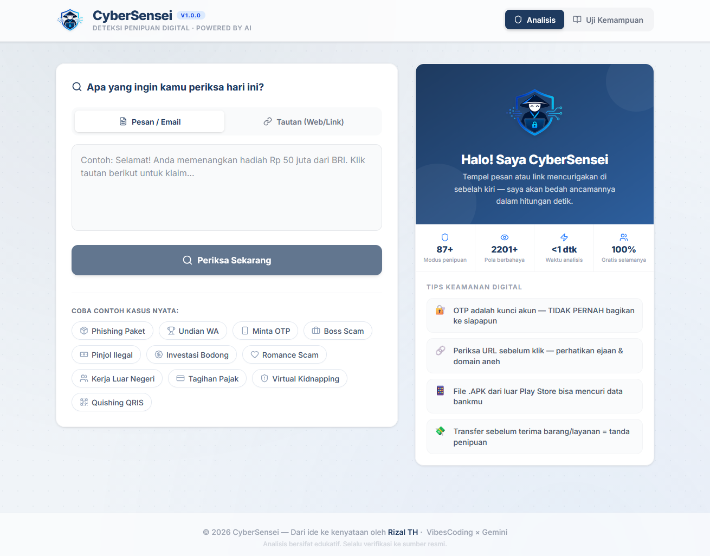
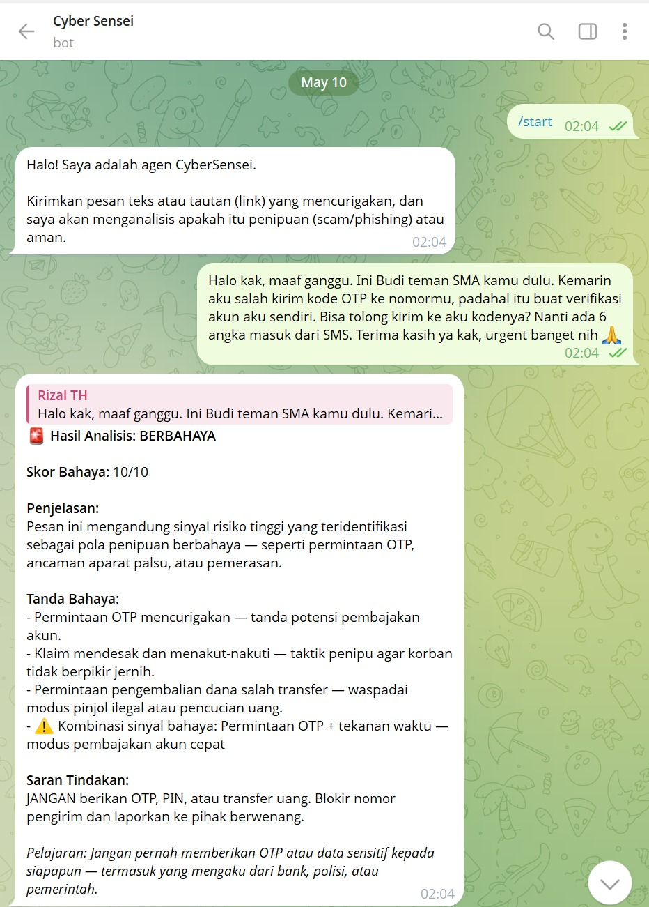
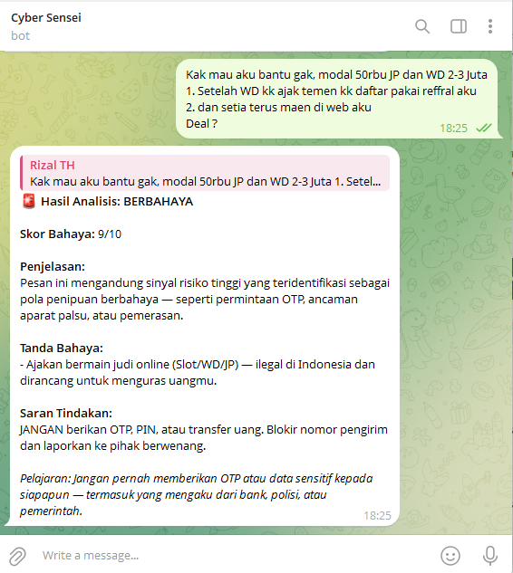

<div align="center">
  
  <h1>🛡️ CyberSensei</h1>
  <p><strong>Deteksi Penipuan Digital Modern &middot; Production-Grade Security Engine</strong></p>
  <p>Dikembangkan untuk <b>#JuaraVibeCoding</b> 2026 oleh <b>Rizal TH</b></p>

  <br/>

  
  
  
  
  
  
</div>

<div align="center">
  <br/>
  
  <br/>
  <em>Tampilan utama CyberSensei — tempel pesan mencurigakan, dapatkan analisis tingkat tinggi secara instan.</em>
  <br/><br/>
</div>

---

## 📌 Apa itu CyberSensei?

**CyberSensei** adalah asisten keamanan siber cerdas (*Threat Analyzer Engine*) yang mendeteksi berbagai ancaman penipuan digital terkini (Phishing, Scam, Pig Butchering, Remote Access Scams, Bidi Obfuscation, dll.) dengan akurasi tinggi. Dibangun menggunakan arsitektur keamanan *production-grade*, aplikasi ini memberikan analisis komprehensif dalam bahasa Indonesia.

Aplikasi ini hadir dengan **dua antarmuka** utama:
1. **Web Dashboard** interaktif untuk menganalisis pesan dengan laporan visual.
2. **Chatbot Agent** (Telegram/WhatsApp) untuk perlindungan keamanan *real-time* dan *on-the-go*.

Dibangun menggunakan desain **Monorepo**, CyberSensei mengisolasi logika cerdas deteksi di `@cybersensei/core` yang disalurkan dengan efisien ke antarmuka React (`@cybersensei/web`) dan Node.js Express Bot (`@cybersensei/bot`), dikemas utuh menjadi **Satu Service Efisien** di Google Cloud Run.

### 🎯 Latar Belakang & Alasan Dibuat

Proyek ini diinisiasi khusus untuk mengikuti kompetisi **#JuaraVibeCoding 2026** dengan tujuan luhur: menciptakan ruang digital Indonesia yang lebih aman. Mengingat modus penipuan (*scam*, *phishing*, *social engineering*) yang semakin canggih dan marak terjadi di masyarakat awam, CyberSensei hadir sebagai solusi edukasi dan perlindungan proaktif yang sangat mudah diakses (cukup via *chat* atau *web*) untuk menganalisis bahaya secara *real-time*.

---

## 🛠️ Tech Stack & Teknologi

| Layer | Teknologi | Peran / Versi |
|---|---|---|
| **Frontend** | React + TypeScript | 19 / Antarmuka Interaktif |
| **Build Tool** | Vite | 6 / Build System Super Cepat |
| **Styling** | Tailwind CSS | 4 / Styling Modern |
| **AI Search** | Fuse.js | 7 / Algoritma Fuzzy-search |
| **Animation** | Motion (Framer Motion) | 12 / Animasi UI/UX |
| **Icons** | Lucide React | 0.546 / Ikon Vektor UI |
| **Backend Bot** | Node.js + Express | 20+ / Server API & Webhook |
| **Bot Framework** | Telegraf | 4 / Pengendali Telegram Bot |
| **Deployment** | Docker + Google Cloud Run | — / Serverless Monorepo Container |

---

## ✨ Fitur Utama & Interaksi Chatbot

Selain web dashboard interaktif yang responsif, CyberSensei dilengkapi dengan **Chatbot Agent** untuk menganalisis teks secara langsung melalui aplikasi *chatting* Anda.

<div align="center">
  <br/>
  
  
  <br/>
  <em>Interaksi langsung pengguna dengan CyberSensei Chatbot untuk mendeteksi penipuan.</em>
  <br/><br/>
</div>

### Mekanisme Penggunaan Chatbot:
Sangat mudah dan praktis untuk digunakan oleh orang awam!
1. **Memulai Sesi (Start)**
   - Cukup kirim `/start`. Bot akan menyapa, memperkenalkan diri, dan siap memberikan analisis keamanan.
2. **Forwarding & Copy-Paste Pesan**
   - Pengguna cukup *meneruskan (forward)* pesan WhatsApp/Telegram yang mencurigakan, atau sekadar *copy-paste* link ke ruang obrolan bot.
   - Contoh: *"Selamat Anda memenangkan undian Rp 10 Juta! Klik link ini: http://shopee-hadiah.com"*
3. **Respon Analisis Instan**
   - Bot merespon awal dengan "🔍 Sedang menganalisis pesan Anda..." sebagai *feedback*.
   - Kemudian secara *real-time*, memodifikasi pesannya dengan **Laporan Analisis Mendalam**, memaparkan tingkat bahaya, deskripsi ancaman, indikator (red flags), hingga skor risiko URL.
4. **Proteksi Anti-Spam (Group Chat Mode)**
   - Bila dimasukkan ke dalam Grup Telegram, bot tidak akan menganalisis setiap pesan yang berisik. Bot **HANYA** akan berjalan jika dipanggil langsung (`@cybersensei_bot tolong cek ini`) atau apabila pengguna me-*reply* pesan milik bot, memastikan grup tetap nyaman dan tidak spamming.

---

## ⚙️ Core Engine & Keamanan (CyberSensei Engine)

`@cybersensei/core` merupakan mesin *Threat Intelligence* tangguh yang memiliki kapabilitas keamanan tingkat produksi:

- **Bidi & Zalgo Obfuscation Normalization:** Sangat tahan terhadap manipulasi *Leet-Speak* yang canggih, memangkas teknik penyamaran karakter dan teks Bidirectional secara otomatis sebelum dianalisis.
- **Path-Based Brand Spoofing:** Secara akurat melacak taktik pemalsuan nama (spoofing) merek-merek ternama yang tidak hanya bersembunyi di domain, namun meluas di dalam *subdomain* hingga ke dalam URL Path yang samar.
- **Multi-Tier TLD Risk Scoring:** Menerapkan sistem penskoran reputasi dinamis berjenjang terhadap ratusan Top-Level Domain (TLD). Bisa membedakan risiko tinggi dari `.top` / `.xyz` secara drastis dibanding ekstensi `.id` / `.com` terverifikasi.
- **ReDoS (Regular Expression Denial of Service) Protection:** Semua *Regex rules* untuk deteksi eksploitasi telah diaudit keamanannya terhadap pola masukan tak berujung (Catastrophic Backtracking) dan input truncation > 10.000 karakter, menjamin server tidak crash oleh *malicious payload*.
- **Modern Threat Intel Database:** *Scam database* secara terus menerus diperbarui, mampu mendeteksi tren penipuan 2025-2026 seperti: *SaaS Phishing*, *Pig Butchering*, hingga *Remote Access / False Trust Scams*.

---

## 🏗️ Arsitektur Proyek (Monorepo)

```text
cybersensei/
├── apps/
│   ├── bot/       # Backend Node.js/Express (Telegram/WA Webhook, Static Proxying, API Limit)
│   └── web/       # Frontend React 19 (Vite, TailwindCSS, Motion)
├── core/          # Engine Analyzer (Fuzzy Logic, TLD Scoring, Obfuscation normalizer)
├── Dockerfile     # Multi-stage build -> Menggabungkan seluruh services dalam 1 Image Server
└── package.json   # Monorepo Workspace Root Manager
```

### Serverless Ready (Google Cloud Run)
Keputusan meninggalkan kapabilitas BYOM (Bring Your Own Model) / eksternal API dilakukan demi mengoptimalkan aplikasi dalam environment *Serverless* / Cloud Run (Stateless). Mesin Core CyberSensei ini bekerja secara *Zero-Data-Retention*, bebas memori database eksternal, sehingga eksekusinya **Sangat Cepat**, **Privasi Terjamin**, dan **Bisa Scale-to-Zero**.

---

## 💻 Panduan Instalasi & Pengembangan

### 1. Pengembangan Lokal

Pastikan Node.js v20+ terinstall.
```bash
# 1. Install semua package monorepo
npm install

# 2. Build semua modules
npm run build

# 3. Jalankan Web Dashboard secara mandiri (localhost:3000)
npm run dev:web

# 4. Jalankan Bot Backend (Lokal)
# Syarat: pastikan buat file .env berisi TELEGRAM_BOT_TOKEN
npm run start:bot
```

### 2. Panduan Set-up Chatbot (Telegram)
1. Buka Telegram, cari **@BotFather**, ketik `/newbot`.
2. Dapatkan token API.
3. Masukkan ke file `.env` di proyek:
   `TELEGRAM_BOT_TOKEN=token_anda`
4. **PENTING UNTUK CLOUD RUN:** Tambahkan *Environment Variable* `WEBHOOK_DOMAIN` dengan URL lengkap Cloud Run Anda (contoh: `https://cybersensei-633534264127.asia-southeast2.run.app`). Aplikasi akan beralih dari mode *Polling* biasa menjadi *Webhook Arch* otomatis agar tidak dihentikan paksa saat Cloud Run tertidur (Scale-to-zero).

### 3. Deploy ke Google Cloud Run (Sekali Jalan!)

*Multi-Stage Dockerfile* di repository ini akan membungkus **Bot API + Web Static Asset + Analyzer Core** hanya dalam **1 Single Container**. Sangat efisien dan hemat biaya.

```bash
# Login
gcloud auth login
gcloud config set project <PROJECT_ID>

# Deploy (Ganti token dan URL anda)
gcloud run deploy cybersensei \
  --source . \
  --region asia-southeast2 \
  --allow-unauthenticated \
  --set-env-vars="TELEGRAM_BOT_TOKEN=<TOKEN_ANDA>,WEBHOOK_DOMAIN=<URL_CLOUDRUN_ANDA>"
```

---

## 🔒 Postur Keamanan Server & Privasi

- ✅ **Helmet.js / CSP Enforced:** Web Dashboard disajikan melalui bot backend yang menggunakan pengamanan HTTP Header ketat (Content Security Policy).
- ✅ **API Rate Limiting:** Cooldown 2 detik (anti-spam) per user via memory dan Rate Limiter 100 req/menit via Express untuk memastikan integritas server dari serangan *bot-net/DDoS*.
- ✅ **Graceful Error Fallbacks:** Apabila parsing gagal atau mesin core melempar eksepsi, bot secara pintar merespon dengan pesan gagal (*graceful failure*), bukan aplikasi yang terhenti paksa.
- ✅ **Privasi Mutlak:** Aplikasi **TIDAK** menyimpan log percakapan maupun kredensial pengguna ke *database*. Sepenuhnya aman (Zero-Data Retention).

---

<div align="center">
  <p><i>Dibuat dengan ❤️ untuk menciptakan ruang digital Indonesia yang lebih tangguh dan aman.</i></p>
  <p><strong>© 2026 CyberSensei — Rizal TH</strong></p>
</div>
